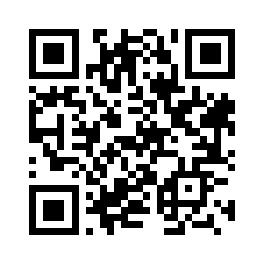
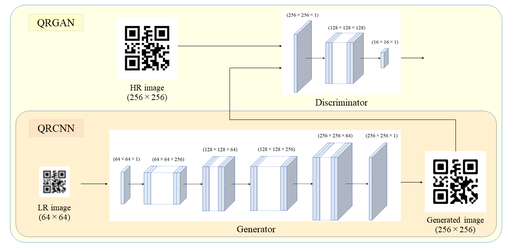

# Super Resolution for QR code images
paper - [Super Resolution for QR Code Images](https://ieeexplore.ieee.org/document/10014154) 
conference - [2022 IEEE 11th Global Conference on Consumer Electronics (GCCE)](http://www.ieee-gcce.org/2022/)
## Abstract
  In this repositorie, we propose super resolution method
for converting unreadable low resolution QR code images into
readable high resolution images. We used Generative Adversarial
Networks (GAN) for super resolution. In general, super
resolution models using GAN such as SRGAN require a lot
of computational complexity and memory usage. As a result, it
is difficult for people to use without high performing GPUs. To
solve this issue, we propose QRGAN, a simple super resolution
model for QR code images. By targeting only QR code images for
super resolution tasks, we enabled to reduce both computational
complexity and memory usage.

## result
  <table>
   <tr>
    <td></td>
    <td></td>
   </tr>
   <tr>
    <td align="center">input</td>
    <td align="center">output</td>
   </tr>
  </table>
  
## proposed method
### ・model structure

Figure 1 shows the structure of the generator and the discriminator. The generator only has 8 layers with 3 convolution
layers and the discriminator only has 4 layers with 2 convolution layers. Contrary to SRGAN, QRGAN only applies
super resolution to grayscale images. As a result, channels
are reduced from 3 to 1, significantly reducing computational
complexity.

### ・loss function
Similar to SRGAN, loss function of QRGAN is consisted
of content loss and adversarial loss, but the content loss is
different. SRGAN uses feature maps of VGG for content loss.
However, QRGAN does not use VGG and alternately use mean
absolute difference of pixels between the generated image and
the ground truth image for the content loss.

### ・dataset
qr_dataset : https://www.kaggle.com/coledie/qr-codes  

The size of the original image varies depending on the image. So, we normalized the size of the images to 256 x 256 [pixels] beforeusing them. We resized the images using bicubic method. We used 1000 QR code images for training, and we used 100 images for test.

 
recommendation   
&emsp; high resolution image-size : 256x256 pixel  
&emsp; low resolution image-size : 64x64 pixel  
&emsp; training epoch : 1  
&emsp; number of images for training : 1000  
&emsp; number of images for evaluation : 100  
